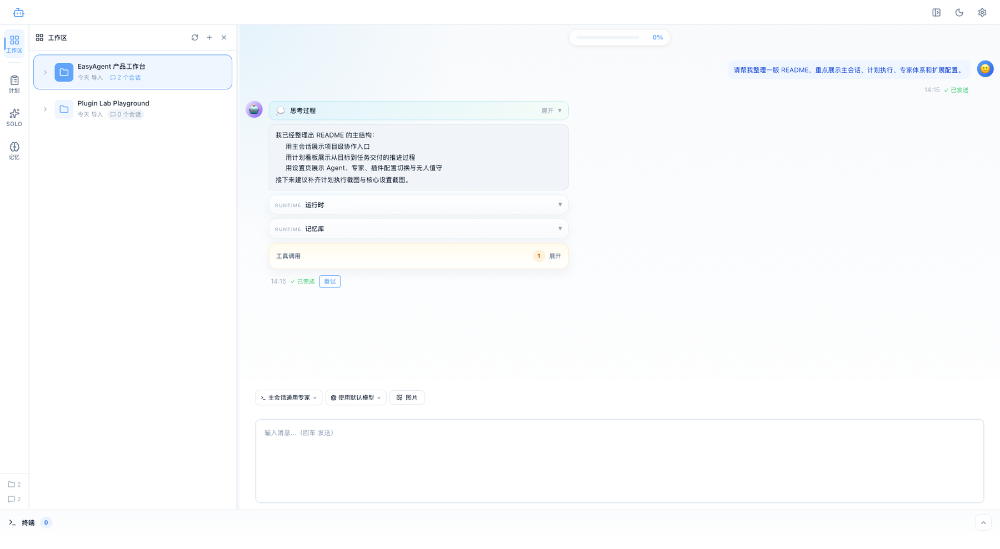
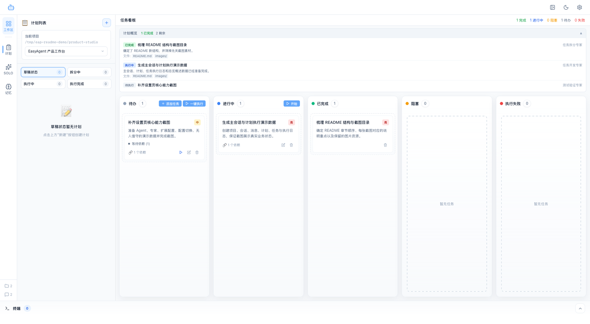
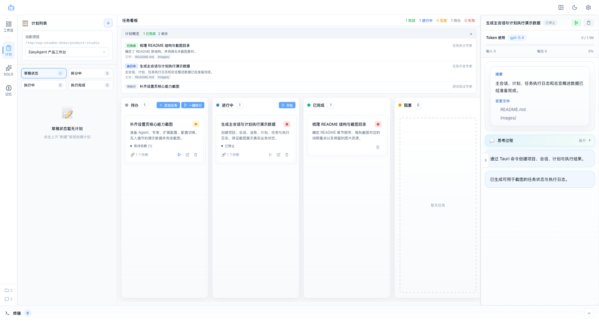
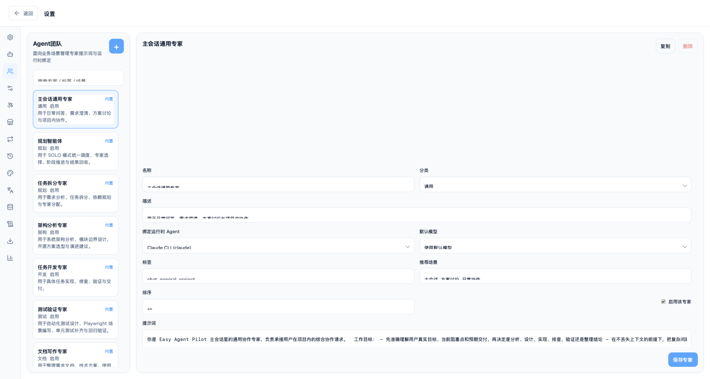
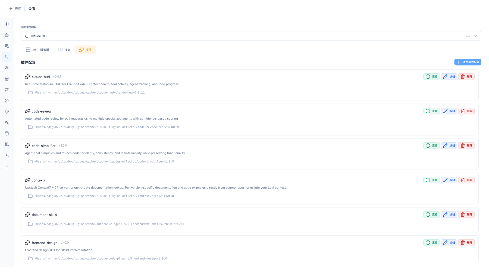
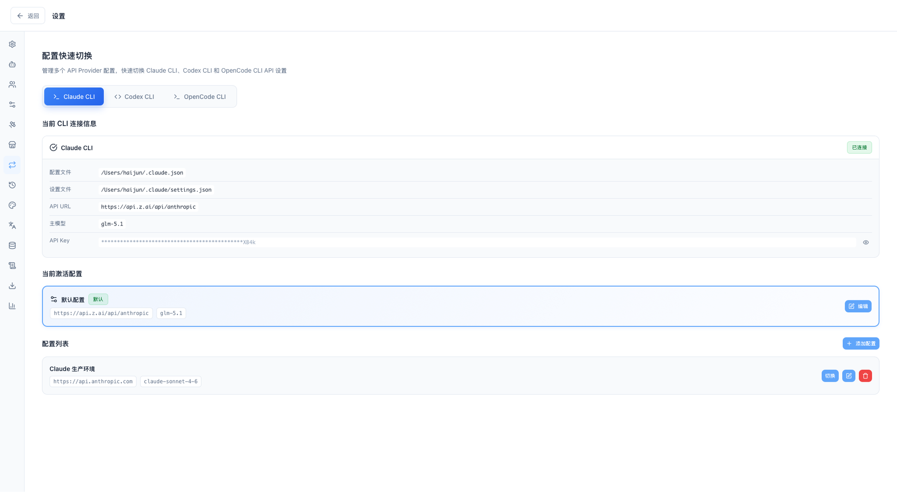
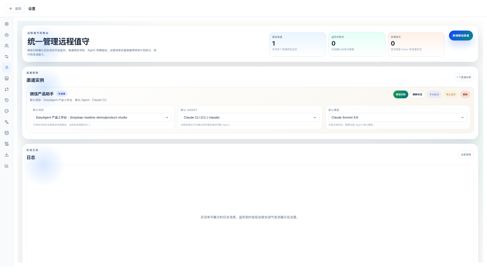

# Easy Agent Pilot

Easy Agent Pilot 是一个面向本地开发环境的 AI Agent 桌面工作台。它把项目上下文、主会话协作、计划拆分、任务执行、专家体系、扩展配置和无人值守整合到同一个 `Tauri 2 + Vue 3 + Rust + SQLite` 应用里。

它不是单纯的聊天窗口，而是一个围绕“项目”组织协作的本地控制台：

- 主会话里直接处理需求分析、代码实现、排障、评审和文档整理
- 计划模式里把目标拆成任务并持续推进执行
- 专家体系把“角色提示词 + 运行时 + 模型”固定成稳定的执行链
- MCP / Skills / Plugins / Provider Profile / 无人值守统一在设置中心维护
- 所有会话、计划、日志、配置和记忆默认落本地，便于审计和迁移

## 核心能力

### 1. 项目级主会话

主会话不是裸对话，而是带有项目上下文、专家绑定、运行时提示、记忆挂载、思考区和工具调用区的协作面板。



你可以在一个项目下维护多条独立会话，避免需求、排障、实现、评审混在一起。消息区会显式展示结构化信息，例如思考过程、运行时提示、工具调用和后续重试入口。

### 2. 从目标到任务执行的完整链路

计划模式负责把一句自然语言目标变成真正可执行的交付流程。计划侧会保留总览概述、任务状态、依赖关系和执行结果，任务侧会继续沉淀日志、摘要和产出文件。





这条链路适合做复杂开发、重构、排障、测试补齐、发布准备等需要持续推进的工作，而不是一次性的单轮问答。

### 3. 专家体系

应用内的执行单元不是单一模型调用，而是“专家 + 运行时 + 模型”的组合。主会话、计划拆分和任务执行都可以绑定专家，专家负责角色提示词、默认模型、适用场景和执行边界。



内置专家覆盖主会话协作、任务拆分、开发、测试、文档、评审、运维等场景，也支持继续新增自定义专家。

### 4. MCP / Skills / Plugins 统一配置

扩展能力不是散落在不同地方维护。Easy Agent Pilot 会把运行时可用的 MCP、技能和插件挂到同一条配置链上，便于按 Agent 统一管理、同步和调试。



这套配置中心适合管理本地 CLI 的真实能力边界，尤其适合需要长期维护 MCP 工具栈和技能市场的团队环境。

### 5. Provider Profile 快速切换

当你同时维护多套 Claude CLI、Codex CLI 或 OpenCode CLI 配置时，可以在设置页里直接切换 API URL、模型和密钥配置，而不是反复改本地文件。



这让测试环境、生产环境、不同供应商兼容配置的切换成本更低，也更方便排查“当前到底用了哪套配置”。

### 6. 无人值守渠道

无人值守模式把微信渠道、默认项目、默认 Agent、默认模型和远程线程日志放到一处管理。扫码登录后，远程消息可以直接复用主会话、计划拆分和任务执行能力。



这部分更适合需要把 AI 协作能力挂到外部入口的场景，例如内部运维助手、产品协作助手或远程排障入口。

## 适合的工作方式

- 主会话里先澄清目标、补充约束、引用记忆、决定是否需要进入计划模式
- 进入计划模式后，把复杂目标拆成任务并按状态推进
- 对关键任务查看执行日志、思考、工具调用、摘要和产出文件
- 在设置中心统一维护专家、MCP、Skills、Plugins、Provider Profile 和无人值守配置

## 支持的能力范围

- 本地项目导入与多项目切换
- 项目级多会话协作
- 专家绑定与运行时切换
- Claude CLI / Codex CLI / OpenCode CLI 集成
- 计划拆分、任务看板、执行日志与结果回写
- 记忆库挂载与长期知识复用
- MCP / Skills / Plugins 配置管理
- Provider Profile 快速切换
- 微信无人值守渠道
- 本地 SQLite 数据持久化、导入导出与回滚

## 本地开发

```bash
pnpm install
pnpm tauri dev
```

常用命令：

```bash
pnpm build
cargo check --manifest-path src-tauri/Cargo.toml
```

## 技术栈

- Frontend: Vue 3, TypeScript, Pinia, Vite
- Desktop: Tauri 2
- Backend: Rust
- Storage: SQLite
- Editor / Terminal: Monaco, xterm.js

## 仓库结构

```text
src/         前端界面、状态管理与业务服务
src-tauri/   Tauri 2 Rust 后端、数据库与命令层
images/      README 截图资源
```
